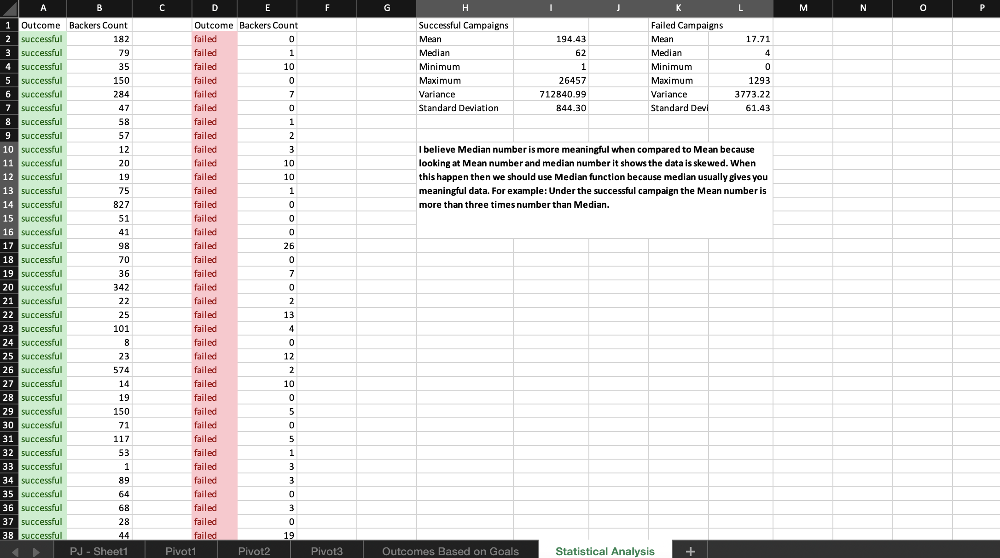

# Excel Homework: Kickstart My Chart

## Background

Over $2 billion has been raised using the massively successful crowdfunding service, Kickstarter, but not every project has found success. Of the more than 300,000 projects launched on Kickstarter, only a third have made it through the funding process with a positive outcome.

Objectives:
Getting funded on Kickstarter requires meeting or exceeding the project's initial goal, so many organizations spend months looking through past projects in an attempt to discover some trick for finding success. For this week's homework, you will organize and analyze a database of 4,000 past projects in order to uncover any hidden trends.

# Task#1:

 A) Created a Conditional Formatting to fill each cell in the State column with a different color for Successful, failed, canceled, or live.
 B) Created a new column O called "PercentFunded". The calculation I used is (pledged / goal)* 100. I have applied three scale color option by using Conditional Formatting > Graded Color Scales. I then applied color scale should start at 0 and be a dark shade of red, transitioning to green at 100, and blue at 200.
 C) Created a new column P called Average Donation and used the formula pledged / backers_count.
 D) Created two new column called Category and sub-Category using the formula function LEFT for the column category and then used RIGHT and FIND function for the sub-Category column.

# Task#2:

 A) Created a new sheet with a pivot table that analyze the initial worksheet to count how many campaigns were successful, failed, canceled, or live per category.
 B) Created a stacked column pivot chart that can be filtered by country based on the pivot table I created.

# Task#3:

 A) Created a new sheet with a pivot table that's analysis of the initial sheet to count how many campaigns were successful, failed, canceled, or live per sub category.
 B) Created a stacked column pivot chart that can be filtered by country and parent-category based on the table I created.

# Task#4:

 A) Created a new column named deadline, launch_at, and Date Ended Conversion columns use Unix timestamps. I have used combination of date function and calculation of the fields.
 B) Created a new sheet with a pivot table with a column of state, rows of Date Created Conversion, values based on the count of state, and filters based on parent category and Years
 C) Created a pivot chart line graph that visualizes the new table.

* Questions:
 
 1) Given the provided data, what are three conclusions we can draw about Kickstarter campaigns?
     a.	It list out all the funding projects such as films, games, and music related shows.
     b.	The excel list shows how many have been success, go live, cancelled, or failed.
     c.	It has backers count, pledged count, and goal information which can help analyst to do more research.

 2) What are some limitations of this dataset?
     a. I think the category and sub-category could have expanded to more detail level.  I believe it is very limited to certain categories only.
     b. I do not see backers information or fund sourcing information. It would be helpful to see where the money came from which will help for future projects or current project.

 3) What are some other possible tables and/or graphs that we could create?
     a. We could create the percentage funded graphs group by state.
     b. We could create a Launched_at (extract Month) graph group by state or categories.

## Bonus:

* Create a new sheet with 8 columns:

  * `Goal`
  * `Number Successful`
  * `Number Failed`
  * `Number Canceled`
  * `Total Projects`
  * `Percentage Successful`
  * `Percentage Failed`
  * `Percentage Canceled`

* In the `Goal` column, create 12 rows with the following headers:

  * Less than 1000
  * 1000 to 4999
  * 5000 to 9999
  * 10000 to 14999
  * 15000 to 19999
  * 20000 to 24999
  * 25000 to 29999
  * 30000 to 34999
  * 35000 to 39999
  * 40000 to 44999
  * 45000 to 49999
  * Greater than or equal to 50000

## Bonus Statistical Analysis
If one were to describe a successful crowdfunding campaign, most people would use the number of campaign backers as a metric of success. One of the most efficient ways that data scientists characterize a quantitative metric, such as the number of campaign backers, is by creating a summary statistics table.

For those looking for an additional challenge, you will evaluate the number of backers of successful and unsuccessful campaigns by creating **your own** summary statistics table.

* Create a new worksheet in your workbook, and create a column each for the number of backers of successful campaigns and unsuccessful campaigns.

* Used Excel functions to evaluate the following for successful campaigns, and then for unsuccessful campaigns:

 * The mean number of backers.

  * The median number of backers.

  * The minimum number of backers.

  * The maximum number of backers.

  * The variance of the number of backers.

  * The standard deviation of the number of backers.

* Use your data to determine whether the mean or the median summarizes the data more meaningfully.

My conclusion is the Median number is more meaningful when compared to Mean because looking at Mean number and median number it shows the data is skewed. When this happen then we should use Median function because median usually gives you meaningful data. For example: Under the successful campaign the Mean number is more than three times number than Median.

## Submission

* To submit your homework, upload the solution and files to a GitHub repo, Dropbox, or Google Drive and submit the link to <https://bootcampspot.com/>.

## Rubric

[Unit 1 Rubric - Excel Homework: Kickstart My Chart](https://docs.google.com/document/d/1RucBXrHMoOa8E4lta5bfaAfUxvRBvMjPELh3uHJL0tY/edit?usp=sharing)

© 2021 Trilogy Education Services, LLC, a 2U, Inc. brand. Confidential and Proprietary. All Rights Reserved.
